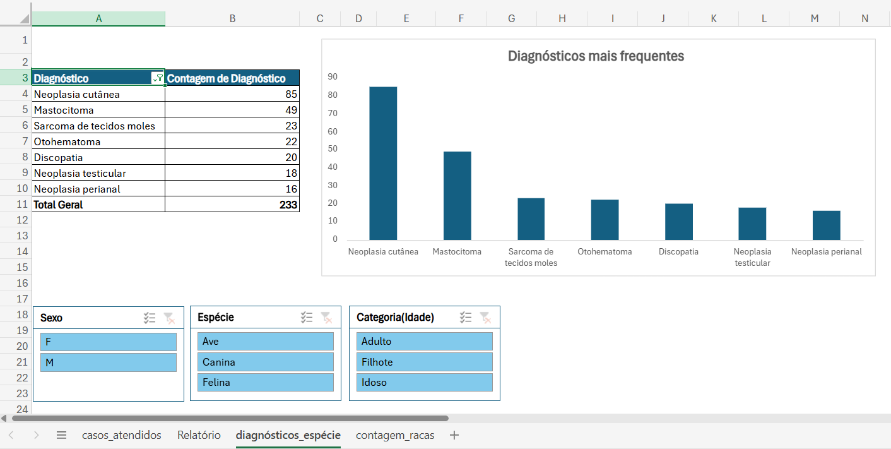
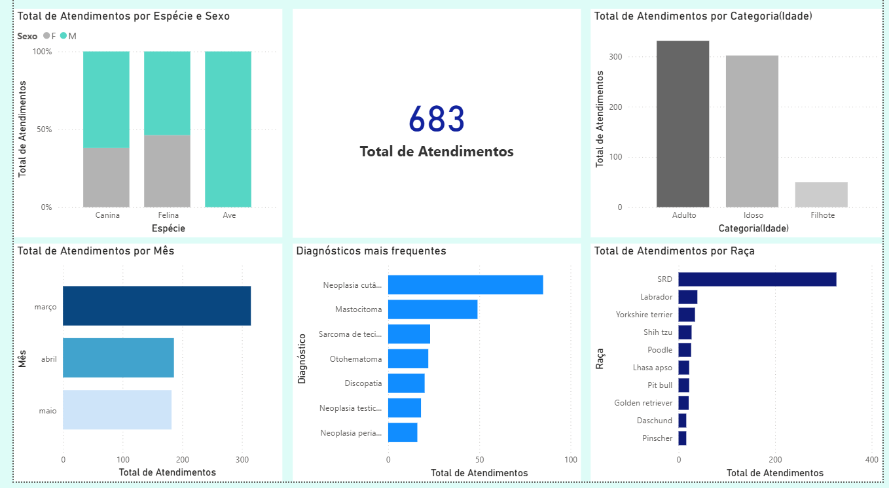

# Análise de Atendimentos Veterinários | Excel e Power BI

Este projeto tem como objetivo explorar e analisar dados de atendimentos veterinários realizados durante meu estágio curricular obrigatório no Hospital Veterinário da USP em 2018. A proposta é aplicar técnicas básicas de análise de dados utilizando Excel e Power BI, conectando esse novo universo à minha experiência prévia na Medicina Veterinária.

---

## Sobre o Projeto

- **Ferramentas utilizadas:** Excel e Power BI  
- **Fonte dos dados:** Arquivo pessoal com registros de atendimentos acompanhados durante 3 meses de estágio no setor de Cirurgia de Tecidos Moles do HOVET-USP  
- **Objetivo:** Treinar e aplicar conhecimentos adquiridos em Excel e Power BI para criar relatórios visuais e gerar insights úteis sobre o funcionamento do hospital veterinário.

---

## Etapas do Projeto

### 1. Tratamento e Limpeza dos Dados (Excel)

- Padronização de nomes e categorias
- Remoção de linhas em branco, caracteres especiais e dados inconsistentes
- Correção de datas e formatação
- Uso de funções como `SE`, `CONT.SES`, `SOMASE`, `TABELA DINÂMICA`, `SEGMENTAÇÃO DE DADOS`

> Exemplo de visualização no Excel:  
> 

---

### 2. Visualização e Análise (Power BI)

- Importação da base tratada
- Criação de medidas DAX simples (`AVERAGE`, `COUNTROWS`, etc.)
- Construção de dashboard com:
  - Atendimentos por espécie e sexo
  - Distribuição etária dos pacientes
  - Diagnósticos mais frequentes
  - Evolução mensal dos atendimentos
  - Raças mais atendidas

---

## Principais Insights

- Cães representaram 81% dos atendimentos, com destaque para cães sem raça definida (SRD)
- Cães adultos e idosos corresponderam a mais de 90% dos casos
- Março concentrou o maior número de atendimentos (315), possivelmente por maior presença minha nesse mês no setor de atendimento.

---

## Contexto e Considerações

Durante meu estágio no HOVET-USP, optei por atuar no setor de Cirurgia de Tecidos Moles. Por esse motivo, houve predominância de diagnósticos oncológicos, geralmente mais comuns em animais adultos e idosos.

Além disso, o hospital oferecia atendimentos a preços acessíveis, o que pode ter atraído tutores de menor renda e, consequentemente, um número maior de cães adotados (SRD) em relação a cães de raça.

A variação no volume de atendimentos entre os meses se explica pela minha atuação prática: em março estive mais no atendimento clínico, enquanto nos meses seguintes acompanhei procedimentos cirúrgicos.

---

## Dashboard (Power BI)

> Visualização interativa com filtros por espécie, faixa etária, diagnóstico e mês de atendimento:  
> 

---

## Próximos Passos

- Aprimorar habilidades em Excel e Power BI  
- Aprofundar estudos em estatística e storytelling com dados  
- Iniciar projetos com Python e bibliotecas como Pandas, NumPy e Matplotlib  
- Criar novas análises com dados públicos ou pessoais de outros contextos

---

## Contato

- [LinkedIn](https://www.linkedin.com/in/fernandomiyazato)  
- [Email](mailto:mztofernando@gmail.com)
